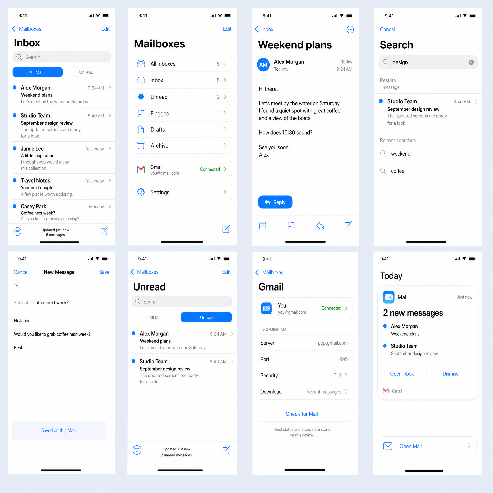

# Mail

An iOS-style email app authored as Octoscript L0 App Cards and rendered by
Makepad on macOS. It uses the shared image-to-appcard pipeline and Makepad's
built-in HTTP instrument. iOS device deployment is not implemented.



## Setup and run

Requires macOS, Rust/Cargo, Xcode command-line tools (`swiftc`), Python 3.11+
and OpenSSL for the local SMTP test fixture. From the repository root:

```sh
python3 -m venv lab/image-to-appcard/.venv
lab/image-to-appcard/.venv/bin/pip install -r lab/image-to-appcard/requirements.txt
lab/image-to-appcard/.venv/bin/python apps/mail/scripts/setup_native.py
bash 'apps/mail/Run Mail.command'
```

The setup command creates pinned native checkouts under ignored
`apps/mail/runtime/native/` and applies the hash-verified compatibility patches
in [native-support/](native-support/README.md). It fetches commits from existing
local submodules when available, otherwise from the declared GitHub repos.
It preserves the shared submodules. The launcher builds a release `beauty-host`
and starts it directly with `--remote`; it does not use Makepad Studio.

A fresh checkout starts with fictional sample mail. Open **Mailboxes → Settings**,
enter the email address/login and a Gmail app password using **Set Password**,
then **Save → Check for Mail**. Defaults are Gmail POP3/TLS on 995, SMTP/TLS
on 465, and Gmail IMAP/TLS on 993. Credentials and mail are not included in Git.
The original development app and its personal mailbox are not moved by this commit.

From `apps/mail/`:

```sh
../../lab/image-to-appcard/.venv/bin/python scripts/run.py --background --headless
../../lab/image-to-appcard/.venv/bin/python scripts/stop.py
```

`--headless` hides the native macOS window while retaining Metal and WKWebView;
it still requires a macOS graphical session. Close an existing owned instance
before changing launch mode. `OCTOS_APPCARD_PIPELINE` overrides the repository
root, `OCTOS_MAIL_NATIVE_ROOT` overrides the isolated dependency directory,
and `OCTOS_MAIL_PYTHON` overrides the launcher's Python executable.

## Mail features

- **Inbox:** fixed subject search over downloaded mail, unread/flagged filters,
  continuous scrolling, automatic older-message batches of 25, retry and
  scroll-position restoration. A 60-row window bounds native widget count.
- **Reader:** complete vertical scrolling without pagination. HTML uses Apple's
  native WKWebView, including formatting, tables and embedded CID images.
  **Load images** enables external images for that message; scripts and forms
  are blocked. Plain messages use a native scroll view.
- **Compose / Reply:** Send through verified TLS SMTP, threading headers,
  editable local drafts, and local Sent records. A per-account delivery journal
  prevents automatic duplicate sends after restart or ambiguous SMTP acceptance.
  Definite failures can retry; uncertain delivery disables Send and offers
  **Check Sent** against the exact Gmail Message-ID.
- **Attachments:** the paperclip opens a scrollable list. Open extracts the
  selected MIME file, verifies size/SHA-256 and previews common documents/media
  in Quick Look. Other types are revealed in Finder. Older cached messages
  hydrate attachment content through IMAP `BODY.PEEK`.
- **Gmail sync:** read/unread, star/unstar, archive/restore and label moves use a
  durable queue with Retry. Refresh pulls server metadata while preserving
  pending local changes. **Mailboxes → Gmail folders** browses the server's
  folders and downloads older pages as you scroll. The reader's folder icon
  moves to Inbox or a user label. No delete/expunge action is exposed.
- **Settings:** editable POP3 and SMTP host/port, TLS or STARTTLS, Gmail recent
  mode, Gmail sync toggle, secure password entry, connection tests and isolated
  account caches. SMTP shares the incoming login/password. Gmail IMAP is fixed
  to `imap.gmail.com:993`; arbitrary-provider IMAP is not implemented.
- **App Card:** a separate new-mail card is defined by the flow manifest and can
  be extracted by the shared pipeline.

POP3 downloads are bounded to 2 MB per message. Gmail-folder and on-demand
attachment downloads accept up to 40 MB; larger messages are skipped/reported.
POP3 never issues `DELE`, but Gmail's configured handling of POP retrieval still
applies. Draft editing is local. Search covers downloaded subjects, not the
entire remote mailbox.

Saved credentials live in the owner-only file
`~/.config/octos-mail/credentials.json` (`MAIL_ACCOUNT`, with legacy
`GMAIL_ADDRESS` / `GMAIL_APP_PASSWORD` fallback). `OCTOS_MAIL_CREDENTIALS` selects
another file. Password entry travels through a private AppKit process pipe;
secrets never enter cards, native instrument messages or screenshots.
`private/`, `runtime/` and `pipeline-output/` are ignored.

## Pipeline and design

The original [Image 2 atlas](output/imagegen/mail-atlas.png),
[prompt](source/atlas-prompt.md) and [generation metadata](source/generation.json)
are preserved. Eight reviewed scenes live in `cards/ios-mail-01` through `08`,
including image observations, semantic mappings, native components and actions.
The 2880 × 2880 atlas was adapted to 406 × 776 logical points; strict image
parity is not claimed. Attachment, Gmail-folder and outgoing-settings views
extend the reviewed reader/mailboxes/settings layouts in `scripts/render.py`.
The UI is English; the shared manifest's EN/CN slots do not imply localization.

After setup, from `apps/mail/`:

```sh
APP_PYTHON=../../lab/image-to-appcard/.venv/bin/python
"$APP_PYTHON" scripts/author.py review
"$APP_PYTHON" ../../lab/image-to-appcard-flow/flow.py run \
  --project . --manifest image-to-appcard-flow.json \
  --stages semantic,compile,bundle,service-test
```

Authoring copies content-addressed SVGs into the project's artwork directory.
The bundle contains native scenes and verified vector assets; reference screen
rasters remain design evidence. Generated bundles and run receipts are local.
See the shared [native instrument workflow](../../lab/core/NATIVE-INSTRUMENT.md).
Legacy Studio capture/gate, WASM, hosted checks and pixel-parity gates are not
claimed for this app.

## Tests and evidence

From `apps/mail/`, after native setup:

```sh
APP_PYTHON=../../lab/image-to-appcard/.venv/bin/python
"$APP_PYTHON" -m unittest discover -s service -p 'test_*.py'
"$APP_PYTHON" scripts/verify_completion.py
"$APP_PYTHON" scripts/verify_settings.py --keep-closed
# Optional live checks using the locally configured Gmail account:
"$APP_PYTHON" scripts/verify_gmail_services.py
```

The 30 service/controller tests cover POP3/TLS, MIME, HTML safety, SMTP delivery
and journaling, attachments, Gmail flags/labels, account isolation, async races,
deduplication and folder pagination. Native fixture tests use only the app's
built-in `/snap`, `/click`, `/k`, `/t`, `/g` and `/gq` endpoints. Temporary native
processes exit after testing. Completion tests use a real **local TLS SMTP
server**, an **IMAP protocol fixture**, and an intercepted viewer call after
verifying extracted bytes; they do not send external mail.

Included evidence is scoped and contains fictional fixtures or counts only:

- [Repository validation](evidence/repository-validation.json): a fresh isolated
  native build, 30 service tests, 20 semantic tests, the bundle stages and both
  hidden native fixture suites passed from this directory.
- [Completion controls](evidence/latest-completion.json): Send/Reply,
  attachments, flags, moves, retries, delivery recovery and outgoing settings.
- [Settings](evidence/latest-settings.json): native editing, validation,
  password-result handling, save/reload and account isolation.
- [Live service checks](evidence/mail-services-readonly.json) and
  [content checks](evidence/mail-content-readonly.json): Gmail SMTP/IMAP login,
  folder metadata, a Sent message and attachment download.
- [Original app handoff](evidence/mail-completion-handoff.json): 96 cached
  messages and 29 folders after a native POP3 refresh. This records the original
  development session, not a process started by a fresh checkout.

No real test email or explicit live flag/label mutation was performed. Private
mail, account credentials, running-process state, old Studio scripts, binaries
and bulk build artifacts are excluded from this app directory's tracked files.
