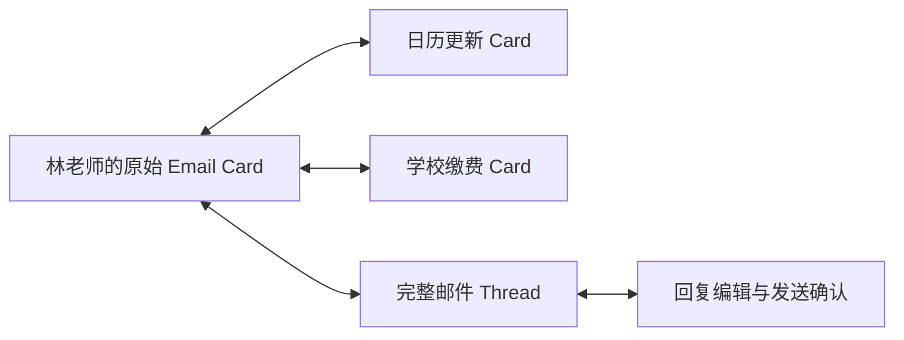

# OctoSense App Card 与事务 Tile 设计需求

更新日期：2026-09-13

状态：记录用户已确认的产品方向，并补充可供设计、原型和实现验收的交互要求。本文描述目标体验，不代表这些能力已在现有 Makepad / WASM 演示或外部服务中实现。

研究背景见 [事务窗口调研](matter-centered-ux-research.md)。本文件是后续事务窗口、来源卡片及旅行时间线的需求入口。

实现分工及现有能力差距见 [L0–L3、Theme Kit 与 Octos 架构评估](layered-architecture-assessment.md)，其中区分渲染阶段、语言能力等级、持久事务数据与卡片交互状态。

## 1. 基本单位与组织方式

**窗口围绕用户正在推进或长期照料的一件事组织，App Card 呈现这件事此刻需要的内容与交互。** 用户可以从任意相关卡片进入，按需要逐步展开完整事务。

| 单位 | 职责 | 示例 |
| --- | --- | --- |
| 事务 Tile | 持久保存一件事的身份、当前状态、参与者、资料、动作与历史；可展开为窗口 | 你的冰箱、年度体检、同学聚会、孩子的兴趣班、健身计划、一次旅行 |
| Sub Tile | 在同一事务中组织某个阶段、子事务或可独立跟踪的环节；可继续展开 | 去程出行、机场接送、航班、抵达接驳、某日活动 |
| App Card | 呈现具体内容、选择、动作、动态状态或执行回执；按需组合进 Tile | 时段选择、日历更新、缴费、登机口变化、车辆到达 |
| 原始内容 Card | 以可交互组件呈现原始邮件、消息、订单、文档或服务事件 | Email Card、Message Card、Order Card |
| 分类及状态视图 | 提供跨事务筛选和待处理入口；引用原事务的卡片与状态 | 家庭、健康、出行；待我处理、等待对方、Agent 处理中 |

事务有三种基础生命周期：长期对象（冰箱、汽车）、阶段性事件（体检、聚会、旅行）、持续计划（健身、兴趣班）。时间线是一种展示方式，可以用于这些不同生命周期，不构成互斥的第四类事务。

- 一项 action 完成后，事务及其资料继续保留，支持收起、归档、检索和重新打开。
- 同一 action 在桌面、待处理队列、父 Tile 或 Sub Tile 中出现时，共享同一状态；不能因多处展示重复执行。
- 阅读、查找资料、比较方案和查看状态也是有效交互，无需为每张卡片强行添加批准按钮。
- 自动归并允许用户修正：把来源移到另一事务、合并或拆分事务时，保留来源与动作历史。

## 2. 任意 App Card 的来源追溯

**每张 App Card 都必须提供查看来源或依据的路径。源于邮件或消息的卡片，应能原位打开对应的真实 Email Card 或 Message Card。** 源于用户输入、订单接口或服务事件的卡片，应呈现对应来源，不虚构原始邮件。

| 编号 | 必须满足的需求 |
| --- | --- |
| SRC-01 | 从 action、状态或回执卡片进入时，先定位支撑当前内容或决定的具体来源，再允许展开完整原文、附件和 thread |
| SRC-02 | 来源关系支持多对多：一封邮件可以关联日历与缴费卡片；一个预约卡片也可以关联多封邮件、群聊和日历信息 |
| SRC-03 | Email Card 保留真实发件人、收件人、时间、主题、正文、附件及所属邮件 thread，支持查看往来和回复 |
| SRC-04 | Message Card 保留发送者、时间、会话及具体消息，支持展开前后文、引用消息和在原会话回复；不同会话不得拼接成伪造的单一 thread |
| SRC-05 | Agent 摘要、翻译和建议与原文分别标识；查看完整内容时不能仅提供模型重新叙述的版本 |
| SRC-06 | 来源后来被修改、撤回或无法加载时，显示实际可用状态；若有保留副本，标明其时间和版本，避免冒充最新原文 |
| SRC-07 | 显示与动作有关的来源版本和时间，允许区分最初通知、后续更改、用户决定及最终服务回执 |

来源入口应按内容使用自然文案，例如“查看老师通知”“查看航空公司更新”“查看司机消息”，同时保留统一的“查看来源”能力。

## 3. 原位 compose 内容与交互组件

这里的 compose 指把原始内容卡片、动作卡片及必要控件组合进当前事务窗口。原始 Email Card 和 Message Card 本身具有阅读与回复能力。



从日历更新卡片出发，用户可查看老师邮件、展开完整往来、打开同源的缴费卡片，再回到日历卡片。整个过程保留当前事务身份。

- **概览层**：说明发生了什么、当前状态以及是否需要用户决定。
- **处理层**：原位展开选择器、表单、回复编辑器及具体动作，保留必要的来源摘要。
- **上下文层**：原位展开完整来源卡片、相关往来和历史，支持继续组合有关卡片。
- 桌面宽窗口可以并排显示动作与来源；窄窗口可以逐层展开，并提供清晰的返回路径。
- 展开、收起及切换相关卡片后，保留输入、选项、草稿、滚动位置与展开状态。返回仅改变视图，不撤销已经发生的服务操作。
- 默认展示直接相关的内容；更深的来源按需加载。循环引用回到已有卡片，避免无限嵌套和重复副本。
- 回复编辑应明确收件人或目标会话、回复对象、正文和附件；审阅、修改与发送有明确边界，发送后显示真实结果并更新相应 thread。
- 日历已更新后的“确认收到”、提交预约、支付以及取消预约必须使用不同动作语义；关闭来源卡片不触发外部操作。

## 4. 时间线 Tile：完整旅行专题

**一次旅行属于同一个持久 Tile。从规划、预订到出行、当地活动和返程，所有阶段及相关卡片均可在这里打开。默认突出当前相关内容，同时保留过去和未来。**

| 范围 | 应包含的内容及操作 |
| --- | --- |
| 规划 | 目的地、日期、同行人、偏好、预算、方案比较、尚未决定的事项；待定项目可暂不填写具体时间 |
| 订票 | 交通方案、航班选择、旅客信息、订单及出票状态、改签或取消方案、电子票与原始通知 |
| 酒店与民宿 | 住宿比较、预订、地址、入住与退房日期、入住说明、房东或酒店消息、变更及回执 |
| 订车与接送 | 租车、取还车、机场接送、当地用车、司机及车辆信息、预约状态和实际到达通知 |
| 导游 | 日期、服务时段、语言、集合地点、行程范围、报价确认及沟通记录 |
| 当地门票与演出票 | 景点、场次、人数、预约时段、票券、入场信息及变更 |
| 餐馆 | 候选餐馆、预订时间、人数、用户填写的需求、确认消息及修改 |
| 其他活动 | 用户或同行人提出的活动、自由时间、集合安排、交通衔接、备选方案 |
| 出行过程 | 出发接送、到机场、航班与登机口变化、抵达手续、行李提取、到达后的用车 |
| 返程与结束 | 回程各环节、租车归还、退房、待完成退款或费用事项、票据与完整旅行记录 |

规划建议、等待确认的预订和已经确认的订单必须明确区分。用户可以从未来的任意安排开始规划或预订，既有依赖关系决定动作是否可执行。

## 5. 旅行 Tile 与出行 Sub Tiles

以下树展示分组与展开关系，具体环节及先后顺序应依据该行程、机场和已获得的信息确定。例如，国内行程可以不包含入境环节，转机可以增加独立航段。

```text
一次旅行 Tile
├── 规划与预订
│   ├── 行程方案 / 交通票 / 酒店与民宿
│   └── 租车 / 导游 / 门票与演出票 / 餐馆 / 其他活动
├── 去程出行 Sub Tile
│   ├── 出发接送 Sub Tile：pick up、司机联系、车辆到达、上车点
│   ├── 到机场 Sub Tile：到达时间、航站楼、值机及相关出行信息
│   ├── 航班 Sub Tile：登机凭证、登机时间、gate 变化、延误与航段
│   ├── 抵达手续 Sub Tile：入境或海关相关信息及用户所需资料
│   ├── 行李提取 Sub Tile：转盘通知、提取状态、异常处理入口
│   └── 抵达接驳 Sub Tile：Uber / taxi / DiDi 等用车与接机通知
├── 当地各日时间线
│   ├── 酒店或民宿入住与住宿
│   └── 导游 / 门票与演出 / 餐馆 / 其他活动 / 当地交通
├── 返程出行 Sub Tile
└── 结束后的记录与未结事项
```

- Sub Tile 收起时显示名称、时间范围、状态与待处理数量，展开后呈现其内部卡片及时间线。
- 用户从司机通知、航班卡或门票卡直接进入时，可以向上展开所属 Sub Tile 和旅行 Tile，保留到达路径。
- 同一预订在“规划与预订”和具体日期下出现时，是同一对象的不同视图；付款、改期、取消和来源只维护一份。
- 不固定每次旅行的嵌套深度和环节数量；没有数据或不适用的环节不占据空白面板。必要的待办可作为明确标识的未完成事项保留。

## 6. 时间线与当前内容

| 编号 | 必须满足的需求 |
| --- | --- |
| TIME-01 | 主行程按照事情计划发生的日期及当地时间组织，而非按照邮件收件时间组织；跨日的航班和住宿显示起止区间 |
| TIME-02 | 同时保留独立的变更记录：何时收到消息、何时修改计划、何时确认、何时执行；从行程卡片可打开这些记录 |
| TIME-03 | 默认定位当前相关阶段，显示“现在”标记、正在发生的事项和下一步；同一时刻允许有多项并行事项 |
| TIME-04 | 过去的卡片可随时展开原文、已做决定、票据及回执；未来的卡片可随时展开、规划或在条件允许时操作，不按演示页码锁定 |
| TIME-05 | 尚未确定时间的事项放在“待安排”；需要提前处理的未来事项按其确认或支付截止时间进入当前待处理区域，仍关联未来行程位置 |
| TIME-06 | 可按日期或阶段定位，提供“回到当前”；用户正在查看历史、未来或编辑内容时，实时更新不强制跳转、不丢失输入 |
| TIME-07 | 所有日期保留对应时区；跨时区航段分别标注出发与到达的当地时间、日期及日期变化，排序使用实际时间关系 |
| TIME-08 | 区分计划时间、预计时间、实际时间和更新时间；明确待定、已确认、进行中、已完成、已取消、需重新确认等状态 |
| TIME-09 | 改期和取消更新同一事项，保留旧安排及来源记录；旧版本明确失效，不继续暴露可重复执行的付款或预约动作 |
| TIME-10 | 当前内容综合时间、实际进展和需要用户决定的事项呈现；仅仅超过计划时间，不能推定用户已登机、已过关或已取到行李 |
| TIME-11 | 父 Tile、Sub Tile、桌面通知和待处理入口同步展示最新状态；重复服务通知归并，不反复生成同一待办 |
| TIME-12 | 缓存的票券与已加载资料可以在离线或连接中断时查看，并标注最近更新时间；实时信息未知时如实显示未知或待更新 |

### 时间线展开示意

```text
旅行 Tile                  查看全程

之前   机票已确认           可打开订单、原始邮件和付款回执
       住宿已确认           可打开地址、入住说明和房东对话

现在   去程出行             展开 Sub Tile
       ├── 出发接送已完成   可查看司机消息和行程记录
       └── 登机口已变化     查看新位置、原始更新和航班上下文

之后   抵达接驳             可提前打开接机安排或选择方案
       酒店入住             可提前查看或回复酒店消息
       明日导游与演出       可提前查看集合地点和票券

                         回到当前
```

## 7. 动态变化与关联处理

设计必须覆盖以下连续体验，外部服务尚未连接时使用明确标识的模拟数据：

1. **登机口变化**：当前航班卡更新新旧 gate、来源及更新时间。用户可以原位展开航空公司原始邮件或服务事件，再查看完整航班上下文。用户查看酒店资料时，不强制把窗口切回航班。
2. **航班延误影响后续安排**：在航班 Sub Tile 显示最新状态，并关联可能受影响的接机、住宿和活动。Agent 提出调整建议，用户可以查看依据、修改或确认；尚未获得服务端确认的调整显示为提议或处理中。
3. **抵达后的接送**：司机或服务通知更新同一接驳 Sub Tile，呈现上车点、车辆、司机和状态。用户可展开原始 Message Card 联系司机；选择方案、提交叫车、已叫车、车辆到达有明确区分。
4. **行李状态与等待**：等待行李时仍可打开稍后的接机安排。若没有可靠的提取状态，允许用户标记“已取到行李”，并把该状态标为用户确认。
5. **住宿与活动冲突**：行程变化后，用户可以并排检查酒店或房东消息、活动规则与新时间，再决定是否调整。对外发送消息、下单、支付或取消遵循该动作已有授权；无适用授权时保留用户确认。

计划变化不能自动等同于已改签、已取消、已通知或已付款。执行结果更新到原卡片，失败时保留输入与明确的后续操作。查看过去卡片、返回上一层和播放上一帧均不代表业务撤销。

## 8. 设计与 image-to-appcard-flow 交付要求

- 支持中文与英文，继承项目字体及视觉规范；标题、标语与卡片短句不加句号，正文保留正常标点。原始邮件和消息保留原文，翻译作为独立视图。
- Tile、Sub Tile、时间线、原始 Email / Message Card 和操作控件采用可组合的 Makepad 组件；图片用于必要的照片等素材。文本、按钮、滚动、展开和回复编辑必须可以实际交互。
- 为事务、子事务、卡片、来源及动作定义稳定身份及关联。设计交付标明来源入口、父级入口、展开与收起状态、输入保存方式和动作结果。
- 一次生成 8–12 个 UX 画面继续用于保持视觉一致性；裁切后转为组件，并以事务状态驱动运行。画面编号仅用于设计覆盖和演示，不限制真实访问顺序。
- 播放、暂停、上一帧和下一帧属于演示控制；用户的预约、支付、回复等业务操作必须独立处理。

建议下一组旅行设计覆盖以下 12 个画面，原始内容展开与历史、未来访问都纳入设计：

| 画面 | 需要呈现的体验 |
| --- | --- |
| 01 | 桌面旅行 Tile：时间范围、当前阶段、待处理事项，打开进入同一事务 |
| 02 | 完整旅行时间线：规划、去程、当地各日、返程，过去与未来可见 |
| 03 | 规划与预订：交通、住宿、租车、导游、票券、餐馆和其他活动的已确认及待安排状态 |
| 04 | 从住宿卡展开原始 Email Card、完整 thread 和回复编辑，收起保留输入 |
| 05 | 出发 pick up：司机到达卡与原始 Message Card 组合 |
| 06 | 到机场：出行 Sub Tiles、当前阶段和之后的航班信息 |
| 07 | gate 变化：当前航班卡更新，展开原始依据并保留旧记录 |
| 08 | 航班延误：呈现与接机和入住的关联、调整建议及确认结果 |
| 09 | 抵达阶段：按实际行程呈现入境或海关信息、行李及接驳子 Tile |
| 10 | 抵达用车：Uber / taxi / DiDi 等服务通知、上车点、司机原始消息及联系操作 |
| 11 | 当地一日：住宿、导游、门票或演出、餐馆与其他活动，打开未来安排 |
| 12 | 回看与继续：展开已完成卡片及回执，再定位后续或返程，并回到当前 |

## 9. 验收场景

以下为后续设计和实现验收标准，不是本次已经执行的运行测试。

| 编号 | 操作或触发 | 预期结果 |
| --- | --- | --- |
| AC-01 | 从老师邮件派生的日历卡打开来源 | 原位看到真实 Email Card，可展开 thread，并找到同源缴费卡 |
| AC-02 | 在原始 Email / Message Card 中编辑回复，展开其他来源后返回 | 回复目标明确，草稿、选项和阅读位置保留，未确认发送前没有外发 |
| AC-03 | 从桌面司机通知进入，再展开父级 | 到达所属接驳 Sub Tile 和同一旅行 Tile，不产生第二份订单或动作 |
| AC-04 | 尚未开始旅行，直接打开未来的导游、餐馆或演出卡 | 可以查看及按条件处理，无需逐张完成之前的卡片 |
| AC-05 | 出行期间打开过去的机票或住宿卡 | 可查看原始邮件、已做决定、票券和回执，不重新执行旧动作 |
| AC-06 | 对比预订邮件收件日、服务日期和改期通知日 | 主时间线落在服务日期，来源与变更记录保留各自时间 |
| AC-07 | 查看未来住宿时收到 gate 变化 | 航班状态更新并提示；不强制跳转、不覆盖当前输入，用户可主动回到当前 |
| AC-08 | 航班延误影响已预订接机 | 关联受影响事项并呈现调整建议；实际接机状态只在相应服务结果到达后更新 |
| AC-09 | 同一动作在父 Tile、Sub Tile 和待处理队列中展示并完成 | 各处结果一致，重复点击或重复通知不产生第二次执行 |
| AC-10 | 打开跨时区、跨日旅行 | 出发与到达当地日期和时间清楚，当前阶段及先后关系正确 |
| AC-11 | 没有原始邮件、来源失效或网络中断 | 展示真实来源类型或不可用状态；保留可用缓存，不生成伪造原文或虚假实时状态 |
| AC-12 | 行程取消、改期或旅行结束后重新打开 | 同一事务可找回，旧版本和回执可查看，过期动作不可重复提交，未结事项继续可见 |
| AC-13 | 切换中文 / 英文，或在窄窗口展开长 thread | 控件可访问、上下文可返回，输入与事务状态保留，原文不被翻译覆盖 |
| AC-14 | 打开未来安排，其中有今天到期的确认请求 | 该事项仍位于未来行程中，并在当前待处理区域显示同一动作及截止时间 |
