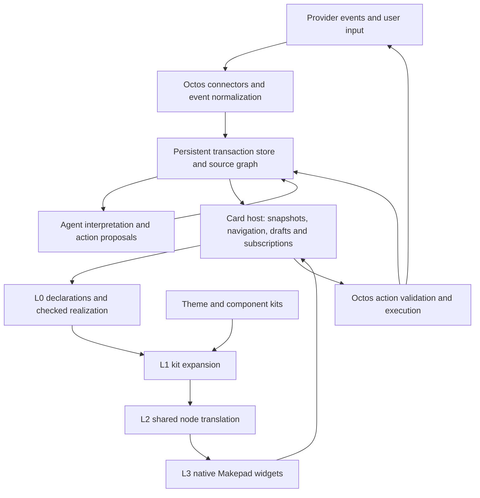

# L0–L3, theme kits, and Octos for transaction-centered App Cards

Assessed: 2026-09-13

This maps the [design requirements](app-card-design-requirements.md) to the local source. It is an architecture assessment and proposed implementation plan. No runtime changes, live provider calls, or new native/WASM tests were performed for this assessment.

Inspected working copies: the project's `pipeline/` checkout at HEAD `225930294e27659e4a8699d140d0835bae8ae726`, its local Splash/Makepad sources, and `/Users/ychen/home/octos` at HEAD `d03ab424fc126c6eb8b9a90db35442c470b5ebed`. These are local-source findings, not a claim about the latest upstream revisions or every client.

## 1. Verdict and terminology

The rendering architecture can accommodate composable cards, source disclosure, and timeline views. The main additions are a persistent transaction model, an account-aware source graph, a shared card host, and a typed action bridge to Octos. New reusable native components are also needed for the complete email/message and timeline experience.

The repository uses **two different meanings of level**:

| Rendering stage, called L0–L3 in the review | Responsibility |
| --- | --- |
| L0 | Check and realize card declarations: sources, state, events, components, slots and semantic views |
| L1 | Expand semantic roles through trusted theme/component-kit definitions |
| L2 | Evaluate/translate to the shared node representation and backend structures |
| L3 | Mount native widgets, lay out, draw, scroll, edit and dispatch physical interaction |

Language capability levels are a separate axis: `Level::L0` admits declarative UI, `Level::L1` adds explicitly declared pure arithmetic, and `Level::L2` is not admitted by this checker. There is no `# level: L3` capability profile. A rich travel window does not require raising its language level merely because it has nested cards or many stages. See the [explicit terminology correction](../pipeline/splash/docs/ui-profile-l0.md#L1377) and [actual Level enum](../pipeline/splash/crates/splash-ui-l0/src/lib.rs#L69).

## 2. What exists, and what needs extending

| Area | Evidence in the inspected implementation | Required extension |
| --- | --- | --- |
| Declarative composition | L0 has components, props, named slots, keyed collection loops, guards and component-local state | Add the source and interaction contracts for matters, source references, timelines and actions; reuse composition rather than generating each full screen independently |
| Reactive state | `InstanceStore`, `DispatchOutcome` and source dependency/invalidation reporting exist | Distinguish ephemeral component state from persistent drafts, view state and authoritative service state |
| Theme/component kits | `kit.json`, tokens, shared definitions and public roles map to dedicated native controls | Add transaction/timeline and content-reader components; establish flexible layouts for arbitrary content and nested mounts |
| Node/native rendering | Both the app host and the service-card WASM host lower L0/kit content into native Makepad widgets | Add shared card mounting, source expansion, stable identity across views, long-content handling and incremental updates without losing focus |
| External tools | Octos has MCP stdio/HTTP clients, OAuth machinery, tool policies and human-approval structures | Preserve structured results, bind accounts and resources, normalize provider events, maintain durable operations and project their results into cards |
| Card transport | Octos's `send_app_card` sends structured channel metadata; current documented consumer types are weather and mission-room cards in Robrix/Matrix | Define a transaction/card snapshot and action protocol for the Makepad host and Astro/WASM client |
| Current service demos | Native input is connected to deterministic scenario reducers, stable service IDs and stale-render checks | Replace fixture-driven progression with persistent transaction data and real provider adapters; preserve the native interaction boundary |

Source: [L0 authoring contract](../pipeline/a2app-l0/framework/l0.md), [native kit contract](../pipeline/splash-makepad/docs/native-l0-kits.md), [app render path](../pipeline/app/app/src/app/l0_card.rs#L355), [WASM mount](../wizard/wasm-host/src/main.rs#L108), [wizard implementation](../wizard/README.md), [Octos card producer](/Users/ychen/home/octos/crates/octos-agent/src/tools/send_app_card.rs#L1).

Two existing kit paths should be accounted for. The app's semantic L0 path uses `kit::lower`, trusted Splash kit functions, the app evaluator and native translation. The source-derived native pack path uses `kit_pack::lower`, checked pack data and the design translator. The current WASM wizard uses the latter. The new host should share card/data/action contracts across them, rather than assuming the two hosts already have identical state and mounting behavior. See [file-backed preparation](../pipeline/splash-makepad/crates/splash-makepad/src/l0.rs#L42).

## 3. Proposed responsibility boundary

Names in the following diagram are proposed modules, not existing Octos APIs.

- **Octos** maintains the continuing matter, interprets events, proposes actions, applies grants/approvals and invokes providers. Deterministic reducers record what actually happened.
- **The card host** selects and mounts appropriate card definitions, supplies scoped data, preserves navigation/drafts and routes typed user actions. It connects the service model to the rendering stack.
- **L0** declares what to display, what to expand, which data is needed and which local interaction state changes. It can remain L0 for these requirements.
- **The kit** owns reusable layout, typography, visual states and component behavior such as disclosure and field editing.
- **The node and native layers** preserve identities, data bindings and input routes through rendering. They handle focus, scrolling, measurement, animation and interaction.

Opening a source, scrolling a thread, selecting a date or expanding a Sub Tile should work without another model turn. Normal provider updates should update data and affected views. The model is used when interpretation, a new proposal or a genuinely new composition is needed. A persistent Tile does not require a continuously running LLM session of its own.

## 4. Persistent matter and provenance model

The current local stores have narrower responsibilities. `L0Session` is keyed by the containing chat-message index and holds an in-memory `InstanceStore`. `user_store` persists ordered reference collections and string preferences. Neither is the complete travel/order/source/action model required here. See [session identity](../pipeline/app/app/src/app/l0_card.rs#L443) and [UserStore](../pipeline/app/app/src/app/user_store.rs#L1).

Proposed records:

| Record | Minimum information and purpose |
| --- | --- |
| Matter | Stable identity, type, title, lifecycle, participants and account/resource scope; e.g. a trip or refrigerator |
| SubMatter | Parent relationship and its own identity, status and schedule; e.g. outbound flight or airport pickup |
| SourceRecord | Connection/account, provider resource/message ID, version, author, source/received times and original-content reference |
| SourceRelation | Explicit `derived_from`, `supersedes`, `belongs_to` and `depends_on` relationships; supports many-to-many provenance |
| TimelineItem | Scheduled/estimated/actual start and end, timezone, deadline, status and links to its matter and sources |
| CardRecord | Stable card ID, definition/version reference, subject matter, bound data revision, source references and available actions |
| ActionRecord | Stable action ID, resource/account, canonical arguments, expected revision, grant/approval, execution status and receipt |
| Draft | Draft ID, account, target thread/conversation, recipients, body, attachments and revision; independent of any mounted widget |
| ViewState | View/mount identity, card ID, expanded sections, selection, navigation path and scroll anchor; independent of service state |

The UI declaration ledger and the business event history have different jobs. Saving or versioning generated card code does not preserve an original email, an accepted booking or a provider receipt. Reproducing a past view also needs its source/data versions and relevant runtime state.

`ValueOrigin` currently distinguishes categories such as source, user input, host and derived values. It does not contain a mailbox identity, message ID, thread reference or evidence span. Preserve that existing origin machinery and add explicit source records/links for user-visible provenance. See [ValueOrigin](../pipeline/splash/crates/splash-ui-l0/src/value_origin.rs#L7).

## 5. Source-card composition and state retention

Within one L0 artifact, components and named slots can compose a compact action with an expandable source view. Independently authored Email, Message and Action cards also need a **host mount boundary**: isolated declarations and local state, explicit data/props, registered component contracts and stable action routes. Pasting entire card documents together would collide in source, state and component namespaces.

Proposed semantic roles include `MatterTile`, `SubTile`, `ActionCard`, `SourceDisclosure`, `EmailCard`, `MessageThread`, `ReplyComposer`, `Timeline` and `TimelineItem`. These are additions to the component catalog, not names claimed to work today. An imported component named `AtroCalendarTimeline...` exists, but its source-derived composition does not establish the required trip lifecycle or timeline interaction.

Preserve three kinds of identity separately:

- **Business identity:** the same booking or payment action wherever it is shown.
- **Source identity:** the exact provider/account/message/version underlying a claim or action.
- **View identity:** each mounted presentation and its local expansion/scroll state.

This is needed when the same source email is opened from a calendar card and a payment card. Both views refer to the same source and actions, while their reading positions may differ. Reply drafts have explicit draft identity rather than inheriting a widget's lifetime.

**A current default conflicts directly with the requirement:** `InstanceStore::prune` discards state for instances no longer mounted, and the app tap path calls it. Collapsing a branch therefore cannot be relied on to preserve draft fields inside it. Keep pruning for ephemeral UI state, but put retained drafts and view state in host-owned stores and restore them when a card remounts. A source/definition change or moving a node to another parent must not silently erase these records. See [pruning](../pipeline/splash/crates/splash-ui-l0/src/lib.rs#L9435) and [host call site](../pipeline/app/app/src/app/l0_card.rs#L1160).

The profile has `realize_patch`, but the inspected app rendering and tap paths use full realization and lowering. The current WASM host mounts a rebuilt scene. Having a patch API does not establish preservation of native scroll position, focus or editor state through an actual update. Add keyed reconciliation or a capture/restore strategy and verify it in both native and WASM hosts. See [patch implementation](../pipeline/splash/crates/splash-ui-l0/src/lib.rs#L10685).

## 6. Agent summaries and original content

The current checker rejects displayed `copy` declared as `model-copy`. This is deliberate in the current profile and conflicts with displaying Agent-authored summaries through that mechanism. See [checker rule](../pipeline/splash/crates/splash-ui-l0/src/lib.rs#L5567).

Add an explicit contract for generated content: summary/draft type, generation provenance, supporting source references, revision and a visible Agent label. Decide and test how that content is admitted into designated summary or draft slots. Do not relabel a model summary as original email, ordinary vocabulary or trusted provider data just to bypass the existing check. Existing `Derived` origin is not an LLM-summary provenance model.

Original emails and messages should enter through source adapters and a document/content model. Full bodies and attachments remain data, not enormous generated `copy` blocks. The native reader needs long-body scrolling, structured text, links, attachments and thread pagination. If a format needs a dedicated document viewer, the host should mount it in context. Summary generation is separate from decoding and displaying the original content.

The inspected Octos email channel already receives mail and carries threading headers, but currently polls `UNSEEN`, extracts the first `text/plain` body and marks fetched mail seen. It needs a durable synchronization/source archive and richer content ingestion before it can guarantee complete original email cards. See [email ingestion](/Users/ychen/home/octos/crates/octos-bus/src/email_channel.rs#L105) and the earlier [email feasibility assessment](agentic-email-feasibility.md).

## 7. Travel timeline ownership

| Requirement | Owner and implementation direction |
| --- | --- |
| Planning through return in one Tile | Persistent matter/submatter model; the host projects it into a timeline |
| Past, current and future cards remain openable | Store all relevant records; mount the requested time range independently of the active phase |
| Pickup, airport, flight, arrival and local transport Sub Tiles | Parent/child matter relationships; reusable disclosure components in the host/kit |
| Ordering and timezones | Trusted timeline projection computes ordering and labels from scheduled/estimated/actual times and timezone data |
| A future activity needs approval today | Keep its future schedule position and expose the same action in the current attention view using its deadline |
| Gate or flight-time update | Normalize the provider event, update the same record and revision, refresh affected views and retain prior values in history |
| Delays affect hotel, pickup or activities | Octos computes dependencies and proposes changes; execution is reflected only after the corresponding result |
| Reading history while an update arrives | Card host preserves the selected context/scroll anchor; shows an update indicator and explicit return-to-current control |
| Long itinerary, messages or attachments | Host-managed pagination/lazy mounts and suitable native scrolling; logical history can exceed one realized tree's resource limits |
| Offline access | Cache source documents and snapshots with timestamps; distinguish unavailable live state from cached content |

Business progress, itinerary time and event-arrival time are different values. A departure time passing does not prove boarding. A hotel booking email arriving today does not place the hotel stay at today's position on the trip timeline.

## 8. Theme-kit work

The kit already contains more than palette tokens: typed properties, child-slot contracts, shared compounds and native button/field/tab behavior. Preserve this design. The new cards should compose these components, with reusable source-header, timeline-marker, status, action-area and disclosure patterns.

The imported source layouts preserve artboard geometry, while the app also has adaptive recipe compositions for some existing cards. Neither establishes responsive travel timelines or arbitrary-length email bodies. New components need flowing layout, wrapping/overflow, minimum touch targets, compact/expanded modes and narrow/wide layouts. See the [kit limitations](../pipeline/splash-makepad/docs/native-l0-kits.md) and [adaptive composer](../pipeline/app/app/src/app/l0_kit_components.rs#L1).

Theme changes must not change source identities, authorization, action semantics or transaction state. The kit controls appearance; resource/account identity remains in the host. Localization supplies labels and formatters, while original content and optional translations remain distinct. Add any missing registered fonts and locale-aware role mappings; the existing app pack adapter exposes body/title roles, so the requested title/body/mono/brand typography should not be assumed complete. See [font mapping](../pipeline/app/app/src/app/l0_pack_theme.rs#L1).

## 9. Octos action and data bridge

Octos provides the starting transport and approval machinery. It needs the transaction-specific bridge described below; naming a new `sys.*` source in an L0 card is not sufficient to connect it.

1. **Typed data ingestion.** Keep provider IDs, versions, documents and structured results. `McpTool::execute` currently joins text content and drops non-text content; it does not propagate `structuredContent` into the returned result. Preserve those fields through tool execution and normalize them into source/domain records. [MCP execution](/Users/ychen/home/octos/crates/octos-agent/src/mcp.rs#L586)
2. **Catalogued read capabilities.** Add narrow matter, timeline, source and action queries with bounded results, lifecycle/error states and account checks. Update the L0 checker/catalog, host resolver and component contracts together. Proposed capabilities are not existing `sys.*` functions.
3. **Typed effects.** Current L0 dispatch reports declared local state changes and a narrow `CollectionWrite` for reference collections/preferences; the app routes those into `user_store`, with a special reader path for `sys.link`. That is not a general send/book/pay API. Add a declared, checked action-reference event/effect or a registered host component event that goes through the action dispatcher. [Dispatch outcome](../pipeline/splash/crates/splash-ui-l0/src/lib.rs#L9588), [host writes](../pipeline/app/app/src/app/l0_card.rs#L1080)
4. **Bound execution.** A client supplies a stored action ID, expected revision and explicit user input. Octos resolves the canonical account, target and arguments; applies the existing grant or approval; then executes and records the result. The client cannot choose an arbitrary MCP method and claim authorization.
5. **Durability and reconciliation.** Persist intent, operation identity and receipts. Handle uncertain provider outcomes before retrying. Existing approval digest/replay checks are useful, but do not themselves guarantee provider-side exactly-once execution. [Approval model](/Users/ychen/home/octos/crates/octos-agent/src/approval.rs#L71)
6. **Shared delivery.** Publish versioned snapshots/updates to all mounts of an affected card. Evolve the existing WASM render/action protocol and Octos channel-card producer around common IDs and revisions, while retaining host-specific transports.

Artifact admission (the host accepting card/kit code) and business authorization (permission to send, book or pay) are separate checks. A theme or card artifact passing the existing admission policy does not grant service access.

A public Astro/WASM client needs an authenticated Octos backend connection for persistent services. Provider credentials stay with that trusted runtime. The same bridge can use local transport in a desktop deployment. See [external-service assessment](octos-mcp-external-services.md).

## 10. Concrete first implementation slice

Use a gate-change card inside one travel Tile to exercise the complete architecture:

1. An airline message or provider event is stored with exact source identity and content.
2. Octos associates it with the existing flight Sub Tile and updates the flight revision.
3. The card host updates the current flight card through data binding and preserves any open hotel draft.
4. The user opens “View airline update”; an Email Card or service-source card mounts in the same context.
5. The user expands the real thread, inspects an earlier card, then opens the future pickup card.
6. If an adjustment is proposed, the user reviews and confirms the stored action; the provider result updates the pickup card and its receipt.
7. Closing and reopening the Tile restores context and drafts; the completed action cannot run again from another view.

Implement in this order:

| Step | Concrete deliverable |
| --- | --- |
| 1 | Matter/source/action records, stable IDs and a persistent local fixture-backed repository; independent of UI mounting |
| 2 | Shared card-host API, retained draft/view state and nested source-card composition using existing native controls |
| 3 | Travel timeline projection and responsive kit components; gate-change scenario with past/current/future navigation |
| 4 | Checked summary/draft provenance and action contracts; registered read/effect adapters |
| 5 | One real mail/source connector and one bounded external action, with operation receipts and snapshot updates |
| 6 | Native and WASM validation of the same requirements before extending to other service scenarios |

The existing image-to-appcard-flow remains the visual/component production path. Its 8–12 images cover states and interactions; transaction progression is driven by data and actions rather than image order. Keep generation, component conversion, model inference, business execution and UI rendering as distinct operations.

## 11. Verification needed for the new requirements

Existing source and review evidence is useful but does not validate the new experience. The next implementation should demonstrate:

- SRC-01–07: real source lookup, many-to-many links, thread identity and explicit generated-content labels.
- AC-02/07/13: drafts, focus, scroll and selections survive disclosure, background updates and locale changes.
- TIME-01–12: timezones, deadlines, past/future access, independent event history, cancellation and offline states.
- AC-03/09: the same action stays consistent across nested mounts and duplicate notifications.
- AC-08/12: changed revisions, confirmed provider results, retry/reconciliation and meaningful cancellation behavior.
- Native widget and WASM tests: use real controls to validate mounting and actions; unit-level realization alone is insufficient.
