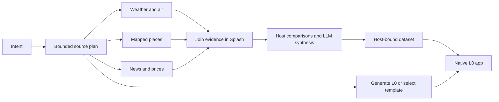

# Twenty intent-driven app compositions on RTX PRO 6000

[Open the interactive gallery](gallery.html) · [All measurements](results.json) ·
[Detailed review findings](findings.json) ·
[Runnable workflow and templates](../../../tools/splash-research/composition/README.md)

[Oil brief design revision](oil-redesign/README.md): a later native UI revision
of case 18, separate from the measurements below.

Twenty different intents were executed with live data, a fresh model-generated
L0 view, and a reusable L0 template. All 40 resulting native apps rendered on the
Mac through Makepad Studio, and all 40 Plan/Evidence/Plan transitions passed.
The gallery contains both native views, both evidence screenshots, the cards,
datasets, workflow traces, model usage and source timestamps for every case.

Reusable templates removed a median **3.20-second layout-generation request**.
Observed median preparation time fell from **8.26 to 6.21 seconds**. These were
sequential live runs with different source responses and improved synthesis rules;
the difference is **not a controlled estimate of template-only speedup**.
Four template results still contain semantic errors. Rendering success should
not be treated as approval of their recommendations.

## Timing

| Measurement | Fresh generated L0 | Reusable L0 template |
|---|---:|---:|
| Median prepare: plan + research + synthesis + layout readiness | 8.26 s | 6.21 s |
| Prepare p95, nearest rank over 20 cases | 15.87 s | 15.69 s |
| Prepare range | 6.48–17.01 s | 4.20–20.60 s |
| Median intent-plan model request | 1.18 s | 1.18 s |
| Median retrieval span | 2.24 s | 1.48 s |
| Median synthesis request | 3.92 s | 2.94 s |
| Median layout model request, including repairs | 3.20 s | No request |
| Median template string instantiation | 0.017 ms | 0.017 ms |
| Median separate native launch to visible content | 0.81 s | 0.87 s |
| Median L0 card size | 3.57 KiB | 2.41 KiB |

“Prepare” is measured on the Mac from intent planning until both the dataset and
L0 layout are ready. It includes real HTTP reads, inference requests, validation
and file output. Retrieval and fresh layout generation overlap: **do not add the
phase rows**. The model request timings include network transport and server
queueing, not just GPU execution. With one active inference slot, the layout
request can delay synthesis even though the client submits them concurrently.

“Native launch” is a separate Studio RunItem launch of the already prepared
snapshot. It includes process startup, card/data admission and visible content.
It excludes research, inference and compilation. It is **not** a measurement of
typing an intent into the normal Octos composer and waiting for the finished app.
The initial release build took approximately 73 seconds and is excluded.
After presentation cleanup, a second native review captured the final screenshots;
`initial_ui` preserves the original launch timing used in the table.

The fresh-layout pass needed two syntax repairs (Kyoto and Beijing running), with
no final template fallback. The final template batch needed one retry after the
San Francisco briefing was classified as outdoor; the host now resolves the
family from its source mix. Completed-run timings exclude that failed admission
attempt and earlier pilot experiments. Its failure record is retained alongside
case 15. The indoor AQI rule skips synthesis inference for case 07, so that case
also differs in inference work between arms.

## What ran

The server reported **NVIDIA RTX PRO 6000 Blackwell Server Edition**, 97,887 MiB,
and served model ID `qwen3.8-27b`. Requests used temperature 0 with thinking
disabled. The existing RTX tunnel was used; H100 was not contacted.
The benchmark sends a small, bounded L0 contract and example to the layout model.
It does not exercise the normal large Octos reference prefix. The endpoint did
not return usable cached-token counts in these responses, so no KV-cache hit rate
or cache speedup is claimed.

The actual standalone Splash VM runs
[composition.splash](../../../tools/splash-research/templates/composition.splash).
The admitted plan becomes a list of 1–8 source jobs. Splash issues every fetch
before the first await, joins results in request order, and invokes synthesis
after all reads finish. Python performs at most four independent I/O jobs at once.
An unavailable source remains an explicit failed evidence record.

All 40 recorded traces place synthesis after the final fetch completion. The
largest spread between the VM's independent fetch dispatches was 0.020 ms.
The median ratio of summed fetch durations to elapsed retrieval span was 1.79
for generated layouts and 1.90 for templates: useful overlap is visible in the
traces. This ratio is descriptive, not a separately measured sequential baseline.

Five L0 template files cover travel, outdoor activity, city comparisons, daily
briefings and market research. They bind the same small dataset contract and
reuse existing themes. They do not embed complete apps, L1 manuals, or arbitrary
network/tool code. The Mac binding is a completed, host-selected dataset snapshot;
it does not yet update incrementally as each research source returns.

## Sources and interpretation

- Weather and modeled AQI: Open-Meteo, with each city's local calendar and timezone.
  “This week” means the remaining dates through Sunday; “weekend” means the
  upcoming/remaining Saturday and Sunday. Daily maxima do not establish hourly
  exposure or guarantee conditions. [API documentation](https://open-meteo.com/en/docs).
- Venues: a bounded OpenStreetMap query within 7 km of the geocoded center, with
  mapped museum/park names and source links. Hours, tickets and suitability are
  unverified. Some queries return only museums; absence from this result does not
  mean a city lacks parks.
- Prices: Yahoo chart responses, with symbol validation and observation timestamps.
  Percentage changes use the preceding daily bar's close. The five-day range
  baseline is not treated as the previous session's close. A single-session move
  does not establish volatility, valuation, a trend, or a news-event return.
- News: live Bing News RSS titles and indexed excerpts from the preceding 72 hours.
  This composition adapter does **not** read full articles. The separate existing
  [live news pipeline](../splash-research-20260909/live-news/README.md) does read
  supported publisher articles; it remains a separate integration path.

The generated pass had four source-partial cases: 03, 05, 14 and 20. The template
pass had six: 03, 04, 14, 16, 17 and 20. The latter lacked venue results for Paris
and London, and news for New York, Apple, semiconductors and the ETF watchlist.
The app shows these gaps. “Ready” in the raw dataset means the requested adapters
returned data; it does not mean the source coverage or model prose is sufficient.

Host code now calculates rain ordering, exact date comparisons, daylight minutes,
quote changes and a conservative outdoor-planning rule. When every forecast day
has a maximum US AQI above 150, the outdoor template selects indoor activity
instead of endorsing a running day from weather alone. The threshold corresponds
to the US AQI unhealthy category; applying daily maxima to itinerary selection is
our conservative heuristic. [AirNow AQI categories](https://www.airnow.gov/aqi/aqi-basics/).

## Visual and content review

All 20 generated and all 20 template Plan screenshots were inspected. Text wraps,
Chinese prose renders, and the source/evidence tabs work. Screens are vertically
dense; later recommendations need scrolling. Some English chrome and titles
remain in Chinese compositions, and metric cards can have unequal heights.
The complete scroll journey and every external source-link destination were not
individually exercised. Evidence screenshots are included for every app.

Observed improvements include the corrected Singapore rain comparison, explicit
indoor exercise in Beijing, heat planning for the New York 32 C high, and host
daylight arithmetic for Tokyo/Kyoto. Citation IDs are constrained to returned
source IDs; empty links are hidden, duplicate citation labels are collapsed, and
internal metadata is removed from user-facing citation text.

Four final template outputs still require content review, and the gallery flags
them explicitly:

| Case | Remaining error |
|---|---|
| 09 · Tokyo packing | Labels the rounded low-to-high temperature range as “highs.” |
| 10 · Seattle weekend | Names September 13 Saturday and September 12 Friday; the ISO dates and weekday prose conflict. |
| 17 · NVDA/AMD | Describes a single-session move as momentum/weakness despite its own limitation. |
| 19 · MSFT/GOOGL | Suggests research priority from one-session resilience and claims company benefits without direct evidence. |

These results support a small deterministic Splash workflow and reusable L0
layout for Octos One. They also show why a valid JSON schema and valid source IDs
are insufficient for recommendation accuracy. Numeric decisions should be
rendered from typed host fields; LLM prose needs stronger evidence checks before
this becomes a general recommendation flow. This experiment does not promote
those four outputs as validated advice or add arbitrary intent search to the
normal Octos composer.

## Validation and reproduction

Twelve regression checks pass, including real VM parallel dispatch, out-of-order
completion, failure propagation, source budgets, unknown replies, result-schema
rejection, quote arithmetic, AQI constraints, daylight comparisons and compilation
of all five templates. The existing 16 Rust release tests also pass. Native
review used the persistent Studio bridge and fresh RunItem builds throughout.

See the [runner instructions](../../../tools/splash-research/composition/README.md)
for the 20-case command, a new `--intent`, native review and gallery export.
The interactive gallery is self-contained except for its relative image/data
files and works from local disk. Original screenshots remain in the experiment
directory; exported PNGs are losslessly recompressed. News excerpt text is
removed from published trace JSON.

## All 20 intents

Times below are preparation seconds for completed runs. See the gallery for the
separate model phases, native timing, screenshots, and review status.

| # | Intent | Generated | Template | Template sources |
|---|---|---:|---:|---|
| 01 | What do you recommend for a Beijing tour this week based on the weather? Include indoor alternatives and actual places. | 13.44 | 6.63 | ready |
| 02 | Plan a Kyoto weekend with gardens when dry and museums when rainy, based on the forecast. | 11.95 | 15.69 | ready |
| 03 | Help me mix Paris museums and outdoor sightseeing over the next three days based on weather. | 17.01 | 13.44 | partial |
| 04 | What should our family do in London this weekend? Combine actual parks or museums with the weather. | 9.63 | 13.64 | partial |
| 05 | Recommend Shanghai evening walks this week using weather, air quality and real places. | 15.87 | 7.66 | ready |
| 06 | Which days this week look best for cycling in San Francisco based on weather and air quality? | 6.48 | 5.95 | ready |
| 07 | 北京这周哪天适合户外跑步？结合天气和空气质量，给我一个简短安排。 | 9.67 | 4.37 | ready |
| 08 | Plan a Singapore family outdoor day this weekend with weather, air quality and actual parks. | 8.46 | 8.36 | ready |
| 09 | What should I pack for Tokyo this week, and which indoor or outdoor places suit the forecast? | 12.10 | 9.82 | ready |
| 10 | Suggest Seattle outdoor sightseeing this weekend with rain alternatives using real places and weather. | 7.30 | 20.60 | ready |
| 11 | 北京和上海，这周末哪个更适合城市散步？比较天气和空气质量。 | 8.60 | 6.47 | ready |
| 12 | Paris or London for a walking weekend? Compare the two forecasts and explain the tradeoff. | 7.68 | 5.81 | ready |
| 13 | Tokyo or Kyoto for outdoor photography this weekend? Compare weather and daylight conditions. | 7.77 | 5.28 | ready |
| 14 | Make a New York workday briefing combining today's weather and business news. | 6.90 | 4.69 | partial |
| 15 | Give me a San Francisco morning dashboard with weather, air quality and current AI technology news. | 8.06 | 6.81 | ready |
| 16 | Any stocks worth researching based on the latest Apple news? Check AAPL and explain the news, quote and risks. | 8.05 | 4.20 | partial |
| 17 | Which of NVDA and AMD is worth further research based on semiconductor news and recent price moves? Show evidence and risks. | 8.30 | 4.54 | partial |
| 18 | Based on current oil and Iran news, compare XOM and CVX as research candidates with quotes and risks. | 7.25 | 4.88 | ready |
| 19 | 结合最新人工智能新闻，比较 MSFT 和 GOOGL 哪个更值得进一步研究，显示价格变化和风险。 | 8.22 | 4.58 | ready |
| 20 | Compare SPY and QQQ for a news-informed market watchlist using latest economic news and recent price moves. | 6.68 | 4.33 | partial |
