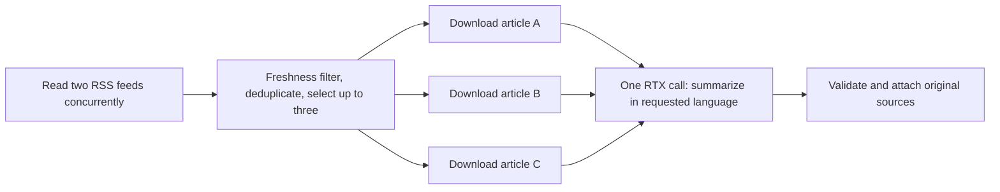

# Real news through Splash and RTX PRO 6000

2026-09-09 America/Los_Angeles / 2026-09-10 UTC. This is the live follow-up to
the earlier fixture experiment. Both discovery and article retrieval perform
real HTTPS requests inside the timed Splash execution. Summaries and translation
use `qwen3.8-27b` on RTX PRO 6000 with SGLang + DFlash2.

Follow-up: the [native Mac news app](native/README.md) now runs this workflow for
typed searches and English/Chinese summaries. The measurements below remain CLI
measurements; the follow-up records separate UI observations.

## Executed pipeline



The [existing Splash template](../../../../tools/splash-research/templates/news-digest.splash)
controls discovery → article reads → digest. The
[live adapter](../../../../tools/splash-research/src/live_news.rs) reads BBC and
Guardian feeds concurrently, filters RSS `pubDate` values to the preceding
72 hours, removes exact URL/title duplicates, and selects three recent items
with source diversity when both feeds have eligible articles. The source
catalog supports technology, world and business; the measured runs use technology.
RSS timestamps can reflect publisher updates, rather than an article's original
publication. This is feed discovery, not comprehensive web search or semantic
deduplication of related stories.

All three selected article downloads overlap. Host-owned extraction rules select
article paragraphs and omit navigation and newsletter signup text. Evidence is
limited to 6,000 UTF-8 bytes per article, ending on a complete paragraph. The
model receives article IDs, titles, source language, text and a truncation flag.
It returns summaries in the requested language in one call; it has no tools and
does not generate source URLs. This uses the current server's single running
inference slot without queuing separate requests for each article.

The host retains source URLs, RSS publication timestamps, retrieval timestamps,
extraction version, byte counts and SHA-256 hashes of the actual evidence.
Published results omit article text. URL/id bindings come from this run's
discovery, not a fixture or model-generated URL. HTTP failures or unsupported
pages are recorded, and only successfully extracted articles reach the model.
Empty discovery skips the model; partial feed coverage, article failures and
rejected/failed summaries produce `partial` status. A partial result can exit
successfully; consumers must inspect its status and diagnostics.

## Final measurements

[Final results and traces](rtx-results.json) contain three fresh live runs per
language in alternating order, with the `news-summary-v3-brief` prompt. All six
returned three source-linked summaries and `ready` status. Trace checks confirm
that all three article downloads began before any completed, and the summary
call began only after the final article completion. The selected sources and
evidence hashes stayed identical across the six runs.

| Output | Passed | Retrieval median | Model-request median | Pipeline median | Whole-process median |
|---|---:|---:|---:|---:|---:|
| English | 3/3 | 0.441 s | 2.346 s | **2.788 s** | 2.808 s |
| Simplified Chinese | 3/3 | 0.494 s | 1.940 s | **2.433 s** | 2.452 s |

Retrieval includes feed discovery plus article downloads/extraction. Model time
includes the HTTP request through the SSH tunnel, server queueing, prefill and
decode; it is not isolated GPU compute. Pipeline ranges were 2.724–3.496 seconds
in English and 2.297–2.797 seconds in Chinese. Separate phase medians need not
sum to the total median. No failed measured run was removed.

The [English and Chinese example](example.md) shows the actual generated briefs
with original source links. The bodies contained 3,766, 3,754 and 5,177 bytes;
none exceeded the evidence budget. Model input was 3,024 tokens in English and
3,041 in Chinese, including the fixed prompt and JSON structure. The server
returned 250 completion tokens in English and 191 in Chinese. These are short
news cards: secondary details are intentionally omitted. English retains the
main recommendation count; the Chinese version omits that count while retaining
the main development. Claims about future events remain attributed warnings,
not statements that those events have occurred.

The [previous two-sentence trial](rtx-results-attribution-prompt.json) had median
pipeline times of 3.886 seconds in English and 5.577 seconds in Chinese, with
median output lengths of 366 and 376 tokens. Requesting one concise sentence
reduced output length and observed latency. This changes the amount of detail;
it is not an equal-output benchmark or a controlled attribution of every
millisecond to the prompt. Trials ran sequentially on a shared server without
cache isolation.

The [recorded runtime](rtx-runtime.json) confirms FlashInfer attention, FP8 KV
cache, DFlash with eight draft tokens, context length 262,144 and one running
inference slot. The GPU was NVIDIA RTX PRO 6000 Blackwell Server Edition with
97,887 MiB reported memory. H100 was not used.

## Reproduce

With the RTX tunnel listening at `127.0.0.1:30881`:

```sh
cargo build --locked --manifest-path tools/splash-research/Cargo.toml --release
tools/splash-research/target/release/octos-one-splash-research-experiment --live-news en technology
tools/splash-research/target/release/octos-one-splash-research-experiment --live-news zh-CN technology
python3 tools/splash-research/digest_bench.py --live --topic technology --repeats 3 --output /tmp/live-news-results.json
cargo test --locked --manifest-path tools/splash-research/Cargo.toml --release
cargo clippy --locked --manifest-path tools/splash-research/Cargo.toml --release --no-deps -- -D warnings
```

The final CLI argument can override the model base URL. No source API key is
required. The runner does not silently use fixture data or a fixture summary
when a service is unavailable.

## Scope and review

Pipeline time includes live feed discovery, live article reads/extraction,
the actual RTX model request, and Splash/schema validation. Process time also
includes executable startup and JSON output. Neither includes native app
generation, rendering or publication. The later native integration is measured
separately in the follow-up linked above.

Repeated runs use fresh network requests but can benefit from upstream HTTP
caches and server prefix caching. No cache was flushed or isolated. The server
does not report cached prompt tokens here, so these timings do not establish a
KV-cache hit rate or a cold-start SLA.

An [initial six-run report](rtx-results-initial-prompt.json) is retained. Review
removed a BBC newsletter signup paragraph and tightened the summary prompt to
preserve individual speakers' positions, absolute years and qualifiers. A final
brief prompt requests one main development per article in one sentence. This
is a fidelity improvement, not a claim that schema validation proves factual
accuracy. Related articles can still appear because deduplication is lexical.

The [first live failure](rtx-tunnel-failure.json) is also retained: all three real
article bodies arrived in 0.742 seconds, but the local RTX tunnel was no longer
listening. The result correctly kept the sources, returned a null digest and
reported partial status with the transport error. The tunnel was then restored
in a persistent session for the successful measurements.

Thirteen Rust tests cover the retained workflow behavior plus live discovery
freshness/URL filtering, exact deduplication, source diversity, bounded Unicode
paragraph extraction, unknown article IDs, evidence redaction, and empty feed
failure diagnostics with no inference. The empty-feed test also caught and fixed
validation rejecting numerically equal JSON values such as `15000` and
`15000.0` after the Splash round trip.
